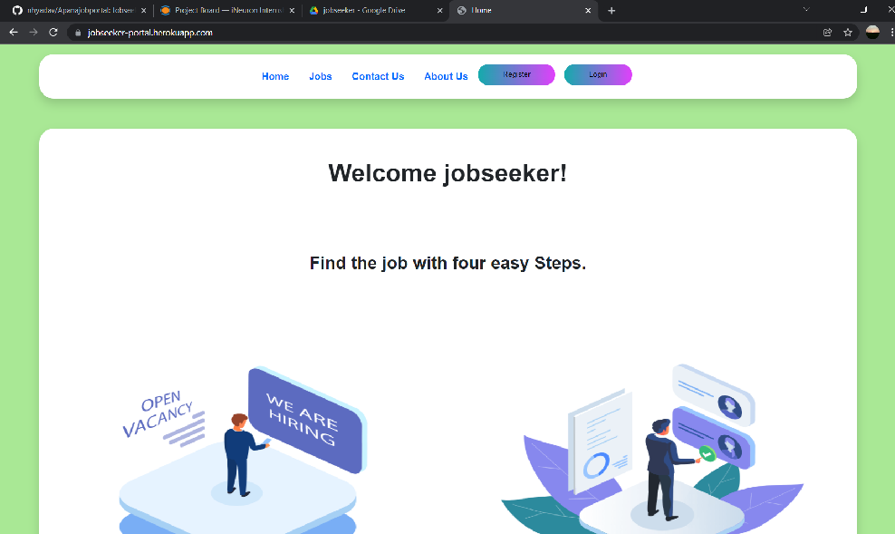
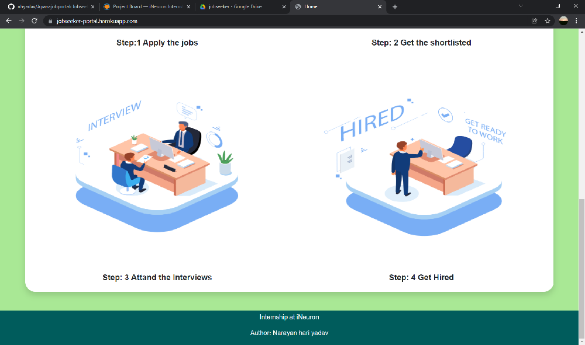
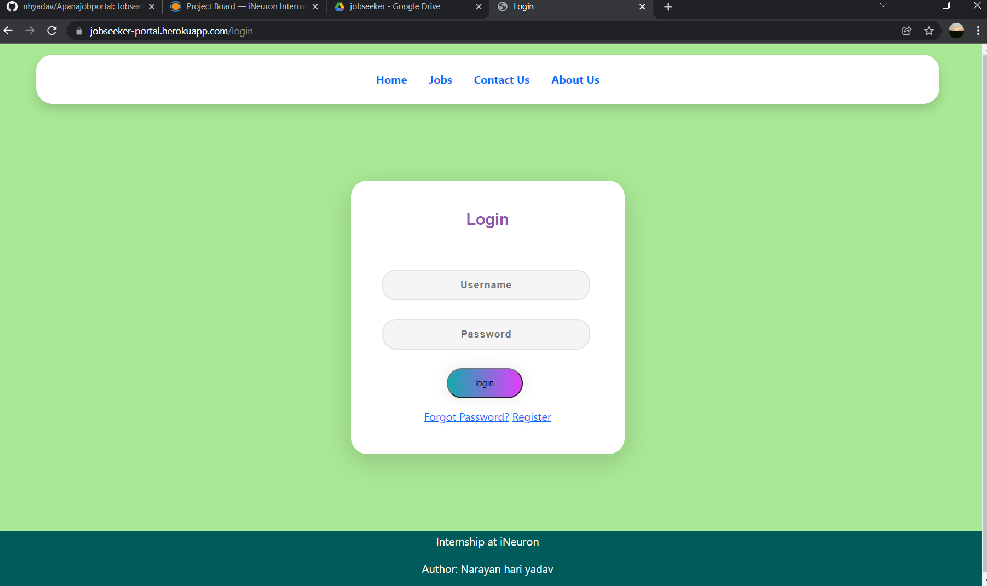
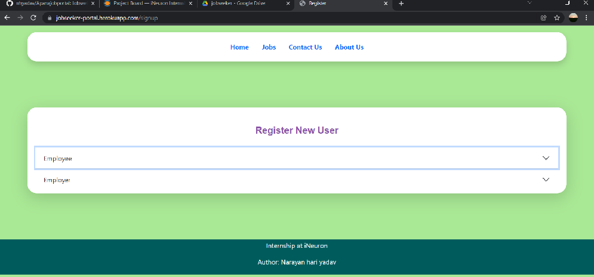

# JOBSEEKER Web Application

## Description
This is a python based web application that is offers different type of jobs for students/freshers and employees. and another opportunity for employers, who can publish many jobs for employees.


## File structure 

    .
    ├── job                         # Django applicaton for storing jobs and emloyees details.
    ├── jobportal                   # Django project directory for settings.py file.
    ├── media                       # directory for storing employees resume.
    ├── portal                      # Django application for login and register authentication of users. 
    ├── staticfiles                 # this directory is used when application will be deployment mode for static file such as css files, images, audiio, videos.
    ├── manage.py                 
    ├── requirements.txt
    └── README.md


## Objectives
this JOBSEEKER web application is developed for employees and employeers, so that  employers can publish jobs for employees.


## Life Cycle of Machine Learning Project
Life Cycle of implementing Web Application.
- Gathering the Data
- Start Designing
- Do Implementaion and Coding
- Perform Testing Module
- Deploy the Web Application


## Homepage






## :hammer_and_wrench: Requirements
* windows (Operating System)
* Python (Programming Language version 3.5+)
* Django (Python Backend Framework)
* git (Version Control Distribution)
* VS code (IDE)


## Deployment
This web app News articles Sorting is deploy on heroku.
- [App link](https://jobseeker-portal.herokuapp.com/)


## :desktop_computer: Installation and Setup
To develop JOBSEEKER Web Application, 
we required environment for development. 
I have used annaconda environment,

```bash
conda create -n envname python=version
```
The above command will create a new environment with specified 
python version.To install requirement library download the requirements.txt file from
current github repository and run the below command. 
```bash
# install all required library in once 
pip install -r requirements.txt
```
In this project, I have used Django python framework. To work with django first we need to create 
project in django then create application by below command.
```bash
django-admin startproject project_name
# create app 
python manage.py startapp app_name
# To run application 
python manage.py runserver 
```

another method for developing this Web Application
- create a conda or virtual environment and clone this git repositor.
```bash
git clone git@github.com:nhyadav/Apanajobportal.git
```

## Attribute
- lottiefiles


## Contibuter
- Narayan Hari Yadav
- Rajan Yadav

# Thank You!

